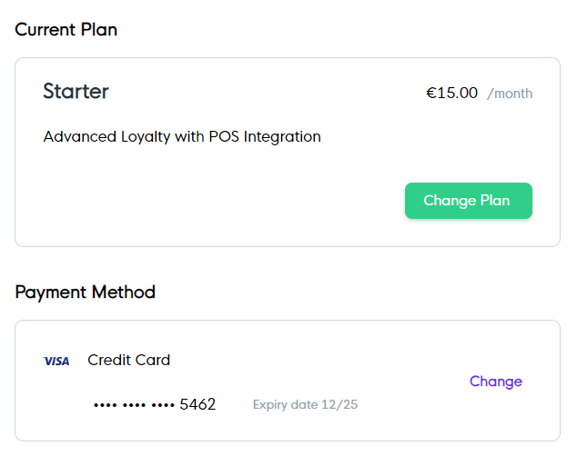
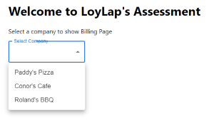
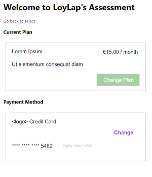

# Welcome to LoyLap's frontend assessment! 

In this project you are required to build the following simple UI components:

  

## Environment requirements
NodeJS v14 or higher

NPM v6 or higher

## Setting up
Please clone `git@github.com:rolegervari/loylap-assessment.git` and run `npm run bootstrap` in the root directory.

## Boilerplate
You are supplied with a boilerplate React app that already has a the following:

1.) `App` component with routing declared

2.) (default route) `Entry` component which is a plain select box of companies already fetched in the `App` component

  

3.) `Billing` component with three props `plans`, `cards` and (previously selected) `company`. You can see their type definitions in the next section.

The placeholders are svg files that you will replace with the components you are going to build.

 

## Data structure

These are the type definitions for each element in the arrays that those endpoints are returning:

```
type PlanName = 'Free' | 'Starter' | 'Grow'
type CardType = 'visa' | 'mastercard'

interface Plan {
  name: PlanName;
  description: string;
  value: number; // stored in cents
}

interface Company {
  id: number;
  name: PlanName;
  plan: string;
}

interface Card {
  companyId: number;
  type: CardType;
  expiry: string;
  lastFour: string;
}
```

## What you need to do
- implement the two missing UI components based on the data supplied and fit them in the Billing page component
- the UI components must display the the corresponding plan and card data of the selected company
- please display corresponding `visa` and `mastercard` logo in the component that you will display for payment methods instead of text – you can find these in `public/assets/cardtypes`
- the `change` buttons won't need to do anything in either of the components

## What we are looking for
Clean code and attention to detail

## Submitting your work
1.) By creating a public repostitory on GitHub and sending the link to us – in this case a small commit history in the style of conventional commits is preferred

OR

2.) By running `git archive --output=./loylap_assessment_firstname_lastname.tar.gz --format=tar HEAD` and sending the file back to the interviewer
